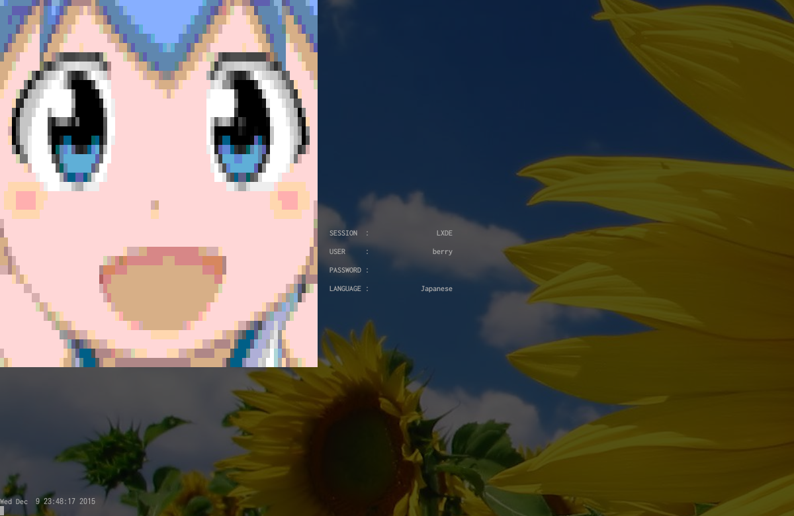

# berry-dm: Display Manager for Berry Linux

Minimalistic display manager for console.

## Features

- Lightweight and minimalistic
- PAM support
- JPEG, PNG, Animated GIF, BMP support

## Installation

To run berry-dm

    $ berry-dm

To make berry-dm

```Bash
clang -o berry-dm -Os berry-dm.c login.c ui.c 3rd/ini.c -lm -lpam -lpam_misc
mv berry-dm /usr/local/sbin/
cp berry-dm.pam /etc/pam.d/berry-dm
cp berry-dm.conf /etc/
cp berry-logo.txt /etc/
clang -Os -o berry-getty berry-getty.c
```

## Configuration

See /etc/berry-dm.conf for example.

## Screenshot



