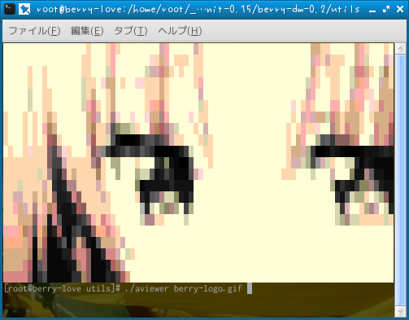

# aviewer: Ascii viewer

A image viewer for console.

## Features

- JPEG, PNG, Animated GIF, BMP support

## How to use

```Bash
clang -Os -I .. -I ../3rd/ aviewer.c -o aviewer -lm
./aviewer <input.gif...>

```

## Screenshot



